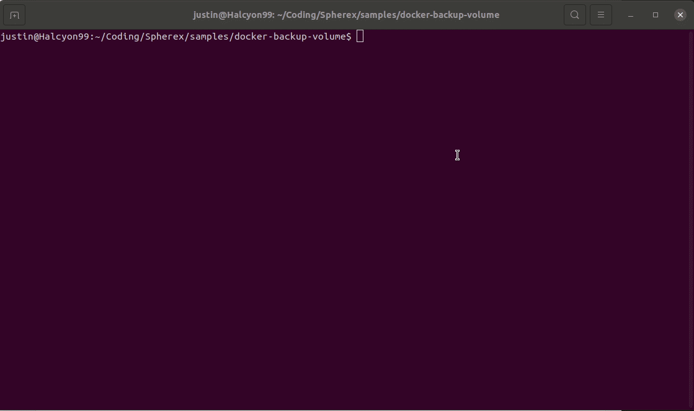
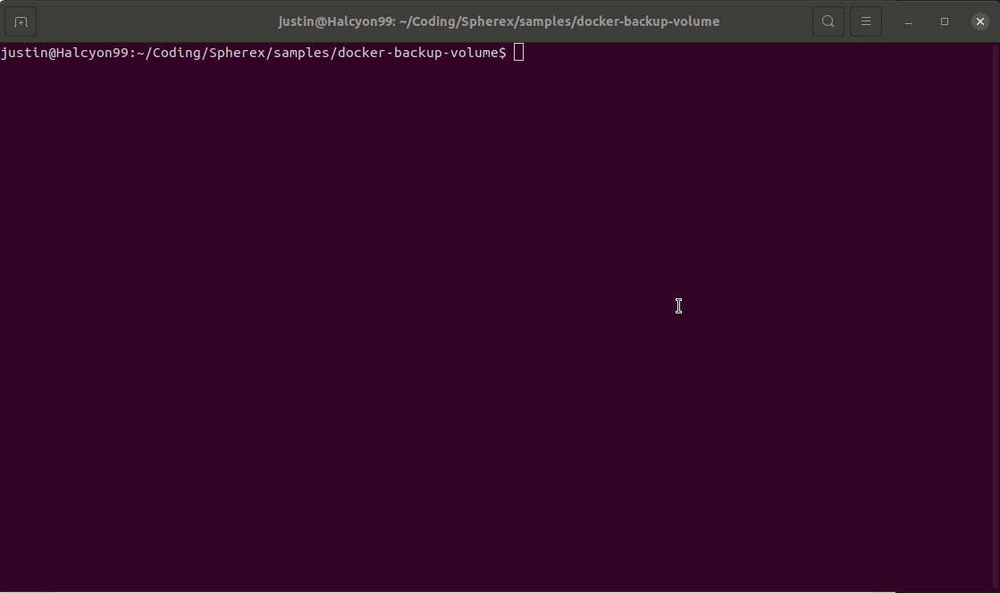

# Backing up your docker volumes

## How to backup your volume

`backup-volume.sh` will create a new running docker container and mount the volume to the container. A `docker cp` will be run and the contents of the volume will be saved into a location determined by:

    $prefix/$volume/<timestamp>_$volume.tar.gz

An example to run the command is the following:

    backup-volume.sh -v <volume_name> -p <prefix>

## Restoring your docker volume

Volumes can be restored using `create-volume-from-backup.sh` by invoking it in the following manner: 

    create-volume-from-backup.sh -v <volume_name> -p <prefix>

Optionally if you wish to create a volume with a different name from the backup the script can be invoked in the following manner: 

    create-volume-from-backup.sh -v <volume_name> -p <prefix> -n <new_volume_name>

## Execution Example

The animation below illustrates how the docker volume `owncloud-docker_files` is saved to `/tmp/backups/owncloud-docker_files`. The volume is saved as a zipped tar file with the date and time it was saved.

The following animation shows how the docker volume is restored from `/tmp/backups` by specifying the snapshot file to restore fom. Note: If you wish to restore the docker volume with a different name than the backup, this can be done by adding a `-n` flag to the command and specifying the new volume name.

### Created by www.spherex.dev

We hope this code is useful for you.